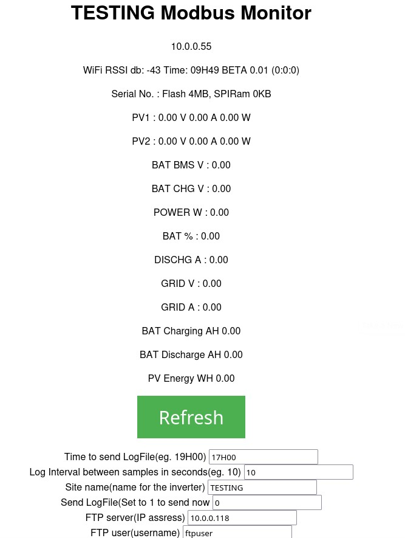
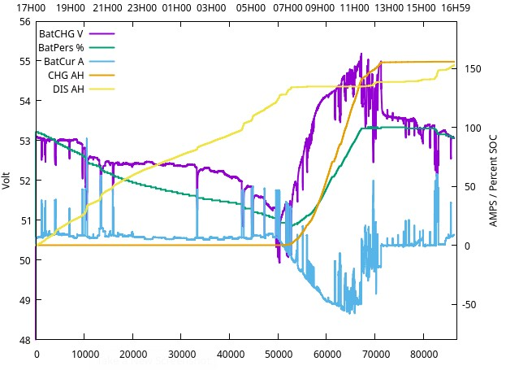
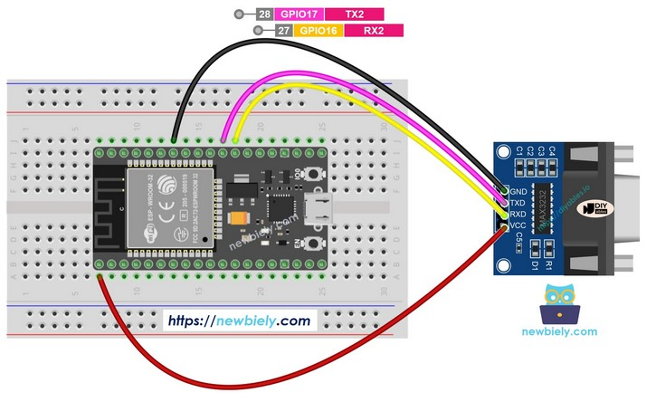



ESP32 Display Deye RS232 Modbus register values

# Description
I wanted to read data from my Deye Inverter (Moddle SUN-5K-SG03LP1-EU) but my model do not have the RS486 plug fitted as shown in the Deye manual that mention it is "available on SOME modles". 

So RS232 is the only option. I downloaded 3 programs for ESP32 that claim to read RS232 data, but none worked om my inverter. The Modbus address they use are not valid/available on my inverter RS232 port.

I could not find any documentation on the Internet on Deye RS232 Modbus protocol. (If you have it please send to "EunomiaSolar" at gmail.)

I spend a whole week experimenting with an ESP32 and thr program below to search for the data I needed from my inverter.I found 9600 Baud, 8 bits, no parity, 1 stop bit works fine.
I found a 12 of the most important registers that I needed - See if you can find more - Letme know on "EnomiaSolar" at gmail

# Searching for registers
You can find my experiment in :
https://github.com/eunomiasolar/DeyeRS232ModbusReader/DeyeRS232ModbusReader/RS232RegisterSearcher

# Basic Deye RS232 Modbus reader
Then I wrote a sketch to diaplay the registers I found on the serial console in an infinate loop:
https://github.com/eunomiasolar/DeyeRS232ModbusReader/DeyeRS232ModbusReader/BasicRS232DeyeReader

# Full blown usable code
And finaly a fully usable App that display these registers via WiFi on a browser and generate a “LogYY-MM-DD_hh_mm.csv” file with entries every 10 seconds and transfer this 0.5 GB file via FTP to a PC ftp server that run somewhere on the WiFi network.
https://github.com/eunomiasolar/DeyeRS232ModbusReader/DeyeRS232ModbusReader/ModbusMonitor

# The “.csv” file look like this:

Seq;PV1_V;PV1_A;PV1_W;PV2_V;PV2_A;PV2_W;POW W;BMS V;CHG V;%;DIS A;CHG AH;DIS AH;PV WH

10; 11.10; 0.00; 0.00; 11.10;  0.10;  1.00;  -51.00; 55.20; 53.33; 74.00; -0.69;  0.00;...

21; 11.10; 0.00; 0.00; 11.00;  0.10;  1.00;  -50.00; 55.20; 53.33; 74.00; -0.69;  0.00;...

33; 11.10; 0.00; 0.00; 11.10;  0.10;  1.00;  -50.00; 55.20; 53.33; 74.00; -0.68;  0.00;...

45; 11.10; 0.00; 0.00; 11.10;  0.10;  1.00;  -50.00; 55.20; 53.33; 74.00; -0.67;  0.00;...

57; 11.10; 0.00; 0.00; 11.10;  0.10;  1.00;  -51.00; 53.63; 53.33; 74.00; -0.67;  0.14;...

69; 11.20; 0.00; 0.00; 11.20;  0.10;  1.00;  -50.00; 55.20; 53.33; 74.00; -0.68;  0.14;...

81; 11.20; 0.00; 0.00; 11.20;  0.10;  1.00;  -50.00; 55.20; 53.33; 74.00; -0.71;  0.14;...

93; 11.20; 0.00; 0.00; 11.20;  0.10;  1.00;  -50.00; 55.20; 53.33; 74.00; -0.67;  0.14;...

105;11.30; 0.00; 0.00; 11.20;  0.10;  1.00;  -50.00; 55.20; 53.33; 74.00; -0.69;  0.14;...

# I use the following script to generate a graph with “gnuplot” :

set datafile separator ';'

set key autotitle columnhead # use the first line as title

set ylabel "Volt" # label for the Y axis

set xlabel 'Time' # label for the X axis

set x2label '17H00    19H00   21H00  23H00  01H00  03H00    05H00   07H00 09H00  11H00  13H00 15H00  16H59' # label for the X2 axis

set y2tics         # enable second axis

set ytics nomirror # dont show the tics on that side

set y2label "AMPS / Percent SOC" # label for second axis

set xrange [0:87000]

set yrange [48:56]

set y2range [-80:190]

set key left top

plot "MBmonLog2026-05-28_17H06.csv" \

using 1:4 with lines lw 1, '' \

using 1:7 with lines axis x1y2 lw 1, '' \

using 1:8 with lines axis x1y2 lw 1, '' \

using 1:9 with lines axis x1y2 lw 1, '' \

using 1:10 with lines axis x1y2 lw 1, ''  

# And I get :

# Hardware

You can use any ESP32 Dev board and a RS232 to TTL converter and connect them as follows:

